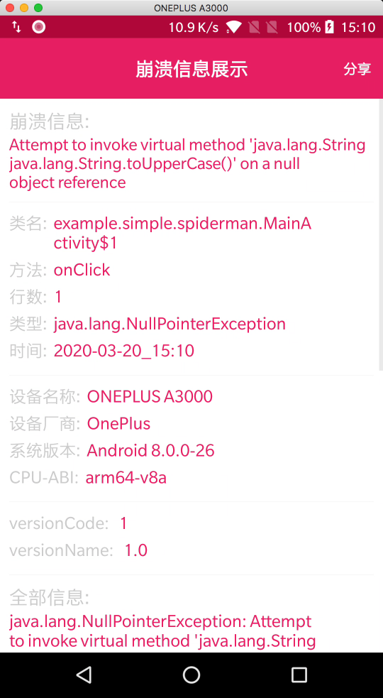
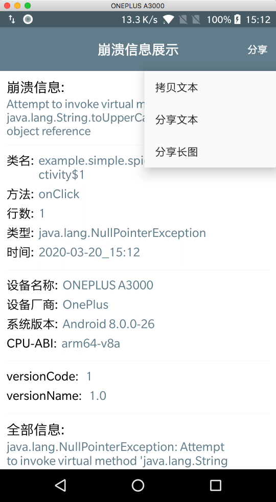

# SpiderMan

[](https://jitpack.io/#simplepeng/SpiderMan)   


SpiderMan能为您做的事：

* 在Android手机上自动显示闪退崩溃信息，直接分享给相关开发人员!
* 再也不用担心测试妹妹给你重现怎样操作才能触发闪退崩溃的尴尬！
* 再也不用担心产品给你说哪儿哪儿会闪退崩溃，但是又不能场景还原的无奈！
* 再也不用担心某些国产Rom禁止异常log输出！
* 再也不用担心开发工具异常log信息输出时灵时不灵！

|               Debug环境               |                       Share                        |
| :-----------------------------------: | :------------------------------------------------: |
|  |  |

## 引入依赖

从`v1.1.8`开始使用`jitpack`仓库，记得添加`jitpack`仓库的引用。

```groovy
maven { url 'https://jitpack.io' }
```

在`app`的`build.gradle`引入依赖：

```groovy
def spider_man = "v1.2.1"
```

### 方式一

```groovy
debugImplementation "com.github.simplepeng.SpiderMan:spiderman:${spider_man}"
releaseImplementation "com.github.simplepeng.SpiderMan:spiderman-no-op:${spider_man}"
```

### 方式二

```java
implementation "com.github.simplepeng.SpiderMan:spiderman:${spider_man}"
```

上面`方式一`debug环境有奔溃信息提示，release环境则没有，`方式二`都有，但是记得添加混淆。

## 直接显示错误页面

有时候可能因为一些特殊环境下才会发生的崩溃很难复现，所以我们不得以会将一些代码放到`try/catch`中运行，这样虽然保证了可以不崩溃，但是当发生崩溃时又会很容易忽略掉错误信息。现在我们可以直接在`catch`代码块中调用`SpiderMan.show(Throwable e)`方法，这样就可以直接显示崩溃提示页面。

```java
try {
      String text = null;
      text.toUpperCase();
    } catch (Exception e) {
      SpiderMan.show(e);
}
```

## Crash回调

发生crash时，如果你希望能拿到异常信息，保存到本地或者其他自定义操作，那么你可以使用下面的回调方法。

```java
//回调crash
SpiderMan.setOnCrashListener(new SpiderMan.OnCrashListener() {
    @Override
    public void onCrash(Thread t, Throwable ex) {
        saveCrash(t, ex);
    }
});
```

`SpiderManUtils`提供了一些封装好的方法，例如`saveTextToFile`，`parseCrash`，自行按需使用。

如果release也需要回调，请使用release回调库，从`1.1.9`开始提供。

```groovy
releaseImplementation "com.github.simplepeng.SpiderMan:spiderman-callback:${spider_man}"
```

## 冲突

### androidx

项目已经依赖了`androidx.appcompat:appcompat`包，如果产生冲突请使用下面的方式依赖。

```groovy
debugImplementation("com.github.simplepeng.SpiderMan:spiderman:${spider_man}") {
    exclude group: "androidx.appcompat"
}
releaseImplementation("com.github.simplepeng.SpiderMan:spiderman-no-op:${spider_man}") {
    exclude group: "androidx.appcompat"
}
```

### support

项目已经依赖了`com.android.support:appcompat-v7`包，如果产生冲突请使用下面的方式依赖。

```groovy
debugImplementation("com.github.simplepeng.SpiderMan:spiderman:${spider_man}") {
    exclude group: "com.android.support"
}

releaseImplementation("com.github.simplepeng.SpiderMan:spiderman-no-op:${spider_man}") {
    exclude group: "com.android.support"
}
```

## 混淆

```java
-keep class com.simple.spiderman.** { *; }
-keepnames class com.simple.spiderman.** { *; }
-keep public class * extends android.app.Activity
-keep class * implements Android.os.Parcelable {
    public static final Android.os.Parcelable$Creator *;
}
# support
-keep public class * extends android.support.annotation.** { *; }
-keep public class * extends android.support.v4.content.FileProvider
# androidx
-keep public class * extends androidx.annotation.** { *; }
-keep public class * extends androidx.core.content.FileProvider
```

## 自定义界面样式

```java
SpiderMan.setTheme(R.style.SpiderManTheme_Dark);
```

`SpiderMan`内置了两种主题样式`light`和`dark`。

|                        light                         |                         dark                         |                        custom                        |
| :--------------------------------------------------: | :--------------------------------------------------: | :--------------------------------------------------: |
|  |  |  |

所有自定义属性定义在`attrs.xml`中

* smToolbar：toolbar的背景色
* smToolbarText：toolb title的颜色
* smToolbarShareText：分享文字按钮的颜色
* smContentBackground：toolb下方内容的背景色
* smIdentText：标签名字的颜色
* smDescText：标签描述的颜色

具体可以参考`app`中的用法。

## 赞助

如果您觉得`SpideMan`帮助了您，可选择精准扶贫🙇🙇🙇

您的支持是作者继续努力创作的动力😁😁😁

萌戳下方链接精准扶贫⤵️⤵️⤵️

**[扶贫方式](https://simplepeng.github.io/merge_pay_code/)**

## 技术支持Q群：1078185041


## 版本迭代

* v1.2.0：解决协程Crash异常信息不对的问题
* v1.1.9：增加`crash-callback`module，升级gradle版本
* v1.1.8：使用`jitpack`仓库
* v1.1.7： 自动初始化
* v1.1.6： 解决view id重名引发的bug
* v1.1.5： 增加`cpu-abi`，`versionCode`，`versionName`输出
* v1.1.4： 切换到androidx
* v1.1.3： change minSdkVersion to 14
* v1.1.2： 解决FileProvider file_path重名bug(bug来源LuckSiege/PictureSelector)
* v1.1.1： 新增直接显示错误页面的方法`SpiderMan.show(Throwable e)`，优化错误类型
* v1.1.0：  增加自定义界面主题和国际化
* v1.0.9： 增加appcompat包冲突解决方案
* v1.0.8： 发现很多小伙伴不会代理异常收集，所以删除了异常回调
* v1.0.7： 删除spiderman-no-op never-crash，优化报错类型显示
* v1.0.6： 增加spiderman-no-op
* v1.0.5： 奔溃文本分享美化排版
* v1.0.4： 崩溃输出改为error级别
* v1.0.3： 增加 拷贝/分享 崩溃文字/图片信息
* v1.0.2： 重构，新增设备信息
* v1.0.1： 去除 allowBackup，label
* v1.0.0： 首次上传

